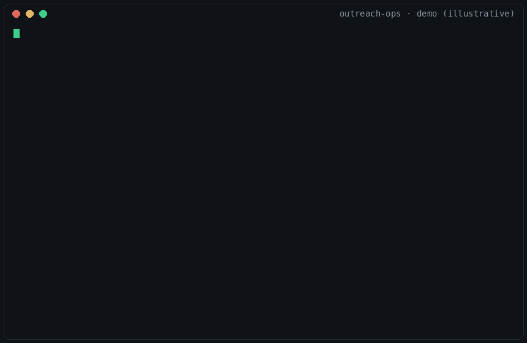

# Outreach-Ops

**AI prospect research, grading & outreach engine — local-first, draft-only, bring-your-own-LLM.**

It researches like an analyst, grades like a skeptic, and writes like you.
And it **sends nothing** — every message is a draft you review.

Whether you're an individual trying to get hired or win clients, or a team
running B2B outbound: paste a company URL, and your AI CLI turns it into a
sourced dossier, an honest 1–5 grade, a channel call, and personalized drafts
— or tells you *not* to contact them and why. Fewer, better messages.



> Built by [Haris Hussain Khan](https://github.com/haris-hk) on the MIT-licensed
> engine behind [career-ops](https://github.com/santifer/career-ops). The
> outreach rework, grading rubric, and signal engine are original work on that
> battle-tested foundation: your AI coding CLI is the brain; deterministic
> zero-token scripts do everything repeatable.

## How it works

```
scan (zero-token signal providers)      grade (A–G rubric, weighted 1–5)
  hiring · funding · launches ·   ──▶     fit · timing · reachability ·  ──▶  drafts (DM ≤300 · email · call)
  OSS · news · directories               budget · hooks · red flags           in YOUR voice, claims evidenced
        │                                     │      below 3.5? it refuses.        │
        ▼                                     ▼                                    ▼
   data/inbox.md ("why now")            data/dossiers/  +  data/leads.md      gates: verified email +
                                                                              spam preflight, then YOU send
        └──────────────── outcomes.tsv → patterns → weekly review proposes tuning (you approve) ─────────────┘
```

## Getting started

**No installer is needed.** Outreach-ops is a plain git repository — clone it,
install dependencies, done. (An `npx` one-command scaffolder ships in
`scaffolder/` for a future npm release, but cloning is the supported path.)

### 1 · Prerequisites

| Requirement | Needed for | Check |
|---|---|---|
| **Node.js ≥ 20** | everything | `node -v` |
| **An AI coding CLI** — Claude Code, Codex, OpenCode, Qwen, Kimi, or Grok | the brain: onboarding, grading, drafting | `claude --version` (see [docs/SUPPORTED_CLIS.md](docs/SUPPORTED_CLIS.md)) |
| Go ≥ 1.22 *(optional)* | the terminal dashboard | `go version` |
| Playwright Chromium *(optional)* | dossier PDFs, page liveness checks | installed in step 2 |
| API keys *(optional)* | enrichment / email-verification plugins | added later via `.env` |

No agent CLI at all? The deterministic layer (scan, ledger, gates, web board)
still works; see [docs/RUNNING_ON_A_BUDGET.md](docs/RUNNING_ON_A_BUDGET.md)
for free-tier and local-model paths.

### 2 · Install

```bash
git clone https://github.com/haris-hk/outreach-ops.git
cd outreach-ops
npm install
npx playwright install chromium   # optional — PDFs & liveness checks
```

### 3 · Health check

```bash
node engine/doctor.mjs
```

On a fresh install this **correctly reports 3 missing files** —
`profile/background.md`, `profile/offer.yml`, `profile/icp.yml`. That's the
onboarding gate: the system refuses to grade against an empty profile. A
"Playwright MCP not detected" warning is safe to ignore (it only affects
fetching JavaScript-heavy pages during scans).

### 4 · Onboard — teach it who you are

Open your agent in the repo and **send any message** (agents don't act until
you speak):

```bash
claude        # then type: hi, set me up
```

It runs the doctor check, sees the missing profile, and interviews you:
your story, proof points (with evidence — it refuses claims you can't back),
what you're selling or seeking, target segments and triggers, and how you
sound. It writes `profile/` as you talk.

Prefer editing files yourself? Copy the templates instead:

```bash
cp templates/profile/background.example.md profile/background.md
cp templates/profile/offer.example.yml     profile/offer.yml
cp templates/profile/icp.example.yml       profile/icp.yml
```

### 5 · Grade your first lead

In the same agent session, paste any company URL (optionally with a contact
name). You get: a legitimacy check, a sourced dossier, a weighted grade with
the arithmetic shown, a channel recommendation, and DM + email drafts — or a
refusal with the trigger to watch for. That refusal is the product working.

### 6 · Optional integrations

```bash
node plugins.mjs available                 # what exists
node plugins.mjs enable hunter --confirm   # consent gate
echo "HUNTER_API_KEY=..." >> .env          # key gate — both required
```

Bundled: `explorium` (firmographics), `hunter` (email find + verify — gates
the send-ready state), `gmail` (read-only reply detection), `notion` (ledger
export), `apify` (keyed scraping source). All are host-allowlisted,
tamper-checked, and off by default.

## Command reference

### Agent modes — `/outreach-ops <mode>` (or plain language)

| Mode | What it does |
|---|---|
| *(paste a URL / prospect info)* | **Default = grade.** Full A–G evaluation → dossier, grade, channel call, drafts, ledger row |
| `grade {target}` | Same, explicit — company URL, person + company, or an inbox/ledger id |
| `scan [segment]` | Run the signal providers against your ICP → `data/inbox.md` with a "why now" per lead, then triage |
| `dossier {lead}` | Deep research (≤12 searches, every fact cited): strategy, moves, pain, budget, competitors, your angle |
| `dm {lead}` | ≤300-char opener, persona-adapted (founder / exec / hiring manager / peer), hooks cited |
| `email {lead}` | Cold email package: 2 subjects + body + bump variant; gated by verify-contact + spam preflight |
| `call {lead}` | 30-second opener, voicemail script, objection prep — for calls *you* place |
| `sequence {lead}` | Multi-touch plan with channel rotation; replies auto-cancel pending touches |
| `batch` | Parallel-grade 10–50 prospects via headless CLI workers, then merge with integrity checks |
| `ledger` | View/update lead statuses, log outcomes, surface due follow-ups |
| `review` | Weekly retro: mines your outcomes, PROPOSES weight/angle/channel tuning — you approve every change |
| `campaign` | Business mode: per-client ICP, preferences, voice, sender identity, and ledger |
| `onboard` | (Re)run the profile interview |

### Terminal commands

**Daily drivers**

| Command | What it does |
|---|---|
| `npm run doctor` | Health check — tells you exactly what's missing and how to fix it |
| `npm run scan` | Zero-token ICP signal scan → lead inbox (`--segment X`, `--dry-run`) |
| `npm run ledger` | SQLite index over the ledger: `sync` · `query --status Sent` · `history --id N` · `export` · `delete --num N` |
| `npm run find -- <query>` | Resolve a company/number fragment to its full lead identity |
| `npm run web` | Read-only local lead board → http://127.0.0.1:4870 |
| `npm run serve:dashboard` | Terminal dashboard (needs Go): tabs, sorting, dossier preview, status picker |

**The outreach loop**

| Command | What it does |
|---|---|
| `npm run outcomes -- log --lead 001 … --event sent` | Append an outreach event (sent/replied/won/…) — the learning-loop substrate |
| `npm run outcomes -- next --lead 001` | Reply-aware next action: send / bump / wait-until / stop |
| `npm run cadence` | Follow-up dates for every active lead per your preferences |
| `node engine/check-replies.mjs` | Ask the read-only Gmail plugin who wrote back; logs `replied` events |
| `npm run preflight -- --file draft.md --company X` | Spam/slop linter — gates the send-ready state |
| `npm run deliverability -- yourdomain.com` | SPF/DMARC/MX/DKIM posture + volume advisories for your sending domain |
| `node engine/enrich.mjs --company X --domain x.io` | Lazy, cost-ordered enrichment fan-out (cached per lead) |
| `node engine/verify-contact.mjs jane@x.io` | Email verification gate — exit 0 valid · 1 invalid · 2 unverifiable |
| `node engine/render-dossier.mjs data/dossiers/001-….md` | Dossier → designed one-page PDF (HTML fallback without Chromium) |
| `npm run patterns` | Reply/win rates by segment × channel × angle × timing, with evidence-backed observations |

**Ledger integrity** (run after manual edits or batch merges)

| Command | What it does |
|---|---|
| `npm run ledger:verify` | Full health check: statuses, links, duplicates, formats |
| `npm run ledger:merge` | Fold batch worker TSVs into the ledger |
| `npm run ledger:dedup` / `ledger:normalize` | Remove duplicates / canonicalize status aliases |
| `npm run ledger:reconcile` | Sync the inbox with batch state |

**Maintenance & meta**

| Command | What it does |
|---|---|
| `npm test` | The full suite (`test:quick` skips the slow bits) |
| `npm run eval:grading` | Run the grading fixtures through a real LLM (`ANTHROPIC_API_KEY` / `OPENAI_API_KEY` / `OLLAMA_HOST`; `--mock` for offline) |
| `npm run plugins` | Plugin CLI: `list` · `available` · `enable <id> --confirm` · `run <id> <hook>` · `trust <id>` |
| `npm run campaign -- new acme` | Scaffold a business-mode campaign (own ICP/voice/sender/ledger) |
| `npm run update:check` / `update` / `rollback` | Self-updater — never touches `profile/`, `data/`, `campaigns/` ([DATA_CONTRACT.md](DATA_CONTRACT.md)) |
| `bash batch/batch-runner.sh --parallel 3` | Headless batch grading (resumable; `--dry-run` first) |

**Individual mode (job search) extras**

| Command | What it does |
|---|---|
| `npm run scan:full` | Direct ATS job scan across 45+ boards (`--seeds yc,a16z` for portfolio sweeps) |
| `npm run liveness -- <url>` | Is that posting/page actually still live? |
| `npm run reposts` | Flag roles re-posted 2+ times in 90 days (ghost-listing signal) |

## Extend it

A new prospect source is one ~150-line file against a stable contract:
[docs/ADDING_PROVIDERS.md](docs/ADDING_PROVIDERS.md). Shipping providers:
hiring-as-buying-signal (45+ ATS boards), GitHub orgs & in-space repo search,
SEC Form D fundraising filings, Product Hunt & Show HN launches, news/RSS,
YC/a16z portfolio lists. Keyed integrations are trust-gated plugins —
[docs/PLUGINS.md](docs/PLUGINS.md).

## The philosophy

Inboxes are drowning in AI slop. The counter-move isn't better spam — it's a
filter. Outreach-ops recommends **against** contacting most prospects, insists
every personalization hook has a source, never fabricates a claim about you,
and hard-stops below the grade threshold. See [LEGAL.md](LEGAL.md) for the
compliance posture (draft-first, no LinkedIn automation, licensed data only).

## Docs

[SETUP](docs/SETUP.md) · [FAQ](docs/FAQ.md) · [Budget guide](docs/RUNNING_ON_A_BUDGET.md) ·
[Supported CLIs](docs/SUPPORTED_CLIS.md) · [Architecture](docs/ARCHITECTURE.md) ·
[Adding providers](docs/ADDING_PROVIDERS.md) · [Plugins](docs/PLUGINS.md) ·
[Contributing](CONTRIBUTING.md) · [Security](SECURITY.md)

## License

Code: [MIT](LICENSE) (includes upstream career-ops copyright — thank you,
[@santifer](https://github.com/santifer)). Use it, fork it, build on it.
